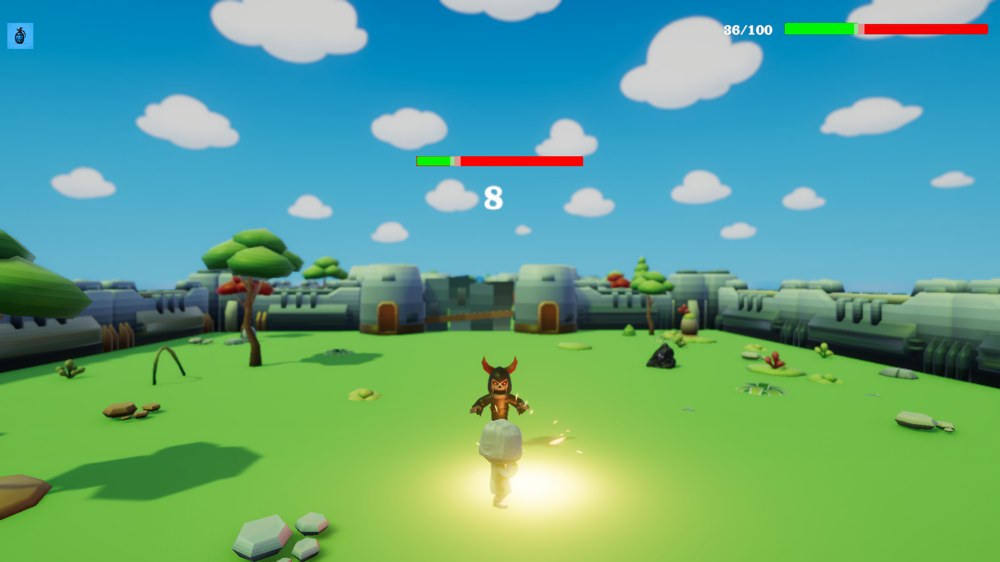
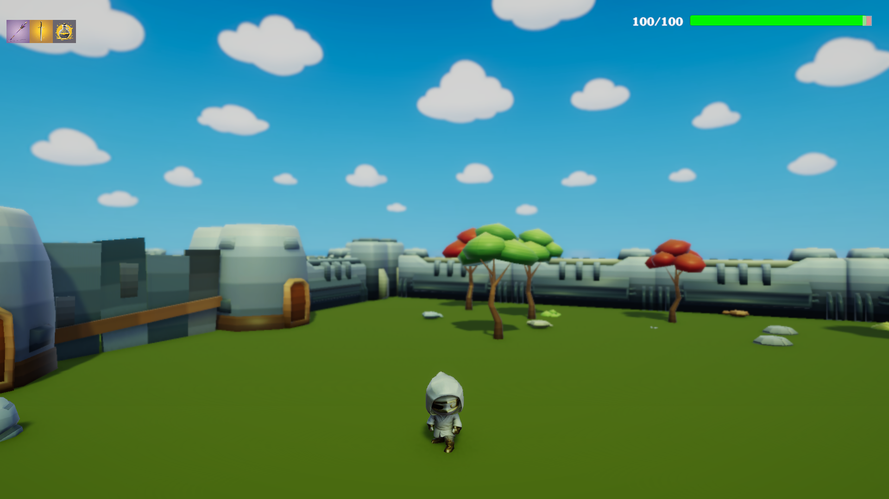

# 🎮 Just Forward

**Just Forward** — прототип 3D-рогалика, созданный на **Unity (C#)**.  
Игрок проходит через процедурно сгенерированные комнаты, сражается со скелетами и разрушает демонические камни, чтобы открыть путь дальше.  
Финальная цель — добраться до портала следующего уровня.

---

## 🖼️ Скриншоты

  
  

---

## ⚔️ Особенности
- Процедурная генерация комнат и уровней  
- Боевая система с несколькими атаками  
- Демонические камни, которые призывают врагов и блокируют двери  
- Прогрессия через 5 уровней с возрастающей сложностью  

---

## 🚀 Запуск игры
1. Скачайте архив из раздела **Releases**.  
2. Разархивируйте в удобное место.  
3. Запустите файл `JustForward.exe` (для Windows).  

*(Если будут билды для других ОС — можно добавить сюда отдельные пункты)*  

---

## 🎮 Управление
- **WASD** — движение  
- **Мышь** — поворот камеры  
- **Space** — прыжок  
- **QER** — удары персонажа  

---

## 📌 Статус проекта
На данный момент это **прототип**:  
- Основные механики реализованы  
- Идет работа над балансом и улучшением визуальной части  

---

## 📫 Контакты
Автор: [Kirill](https://github.com/fenter4ik)  
